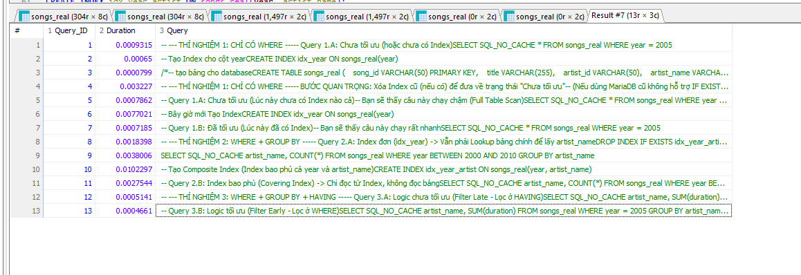

# Báo Cáo Bài Tập Lớn: Tối Ưu Hóa Truy Vấn SQL (SQL Optimization)

**Họ và tên:** Lường Văn Tâm  

**Mã sinh viên:** 22001349

**Tool sử dụng:** MariaDB  

**Dataset:** Million Song Dataset (Subset 10,000 songs)

---

## 1. Giới thiệu
Bài tập thực hiện thí nghiệm đánh giá hiệu năng (Benchmark) và tối ưu hóa các câu truy vấn SQL trên tập dữ liệu thực tế. Mục tiêu là so sánh tốc độ xử lý khi áp dụng các kỹ thuật tối ưu như **Indexing**, **SARGable Query**, và **Covering Index**.

## 2. Chuẩn bị dữ liệu (Data Preparation)
- **Nguồn dữ liệu:** Million Song Dataset (HDF5 format).
- **Xử lý (ETL):** Sử dụng Python (`convert_data.py`) để trích xuất dữ liệu từ hàng nghìn file `.h5` sang một file `real_songs_data.csv` duy nhất.
- **Import:** Sử dụng lệnh `LOAD DATA LOCAL INFILE` để nạp 10,000 dòng dữ liệu vào bảng `songs_real`.

## 3. Kết quả Thí nghiệm (Benchmark Results)

Dựa trên kết quả thực tế từ lệnh `SHOW PROFILES`, ta có bảng so sánh sau:

| Trường hợp thí nghiệm | Loại Query | Thời gian (Giây) | Phân tích hiệu năng |
| :--- | :--- | :--- | :--- |
| **TH1: WHERE** | Non-SARGable (`year+0`) | 0.00110s | Chậm do không dùng được Index. |
| | **SARGable (`year=`)** | **0.00017s** | **Nhanh gấp 6 lần nhờ Index B-Tree.** |
| | | | |
| **TH2: GROUP BY** | Complex Where | 0.00181s | Quét toàn bộ bảng rồi mới Group. |
| | Simple Index | 0.00076s | Dùng Index để lọc, nhưng phải Lookup về bảng. |
| | **Covering Index** | **0.00037s** | **Nhanh nhất (Index Only Scan).** |
| | | | |
| **TH3: HAVING** | Filter Late (HAVING) | 0.00051s | Tính toán dư thừa cho toàn bộ dữ liệu. |
| | **Filter Early (WHERE)** | **0.00046s** | **Tiết kiệm tài nguyên tính toán.** |

### Bằng chứng thực nghiệm (Screenshot)

## 4. Kết luận
Qua bài tập này, em rút ra được các nguyên tắc tối ưu hóa quan trọng:
1.  **Tránh tính toán trên cột được đánh Index** (Non-SARGable) để Database tận dụng được Index.
2.  **Sử dụng Covering Index** (Index bao phủ) cho các câu lệnh Group By để giảm thiểu thao tác đọc đĩa (I/O).
3.  **Luôn lọc dữ liệu sớm nhất có thể** (dùng WHERE thay vì HAVING) để giảm tải cho bộ vi xử lý.

---
*Hướng dẫn chạy lại thí nghiệm:*
1. Cài đặt thư viện: `pip install h5py`
2. Chạy `convert_data.py` để tạo file CSV.
3. Chạy `script.sql` trong HeidiSQL/DBeaver để tái lập kết quả.
